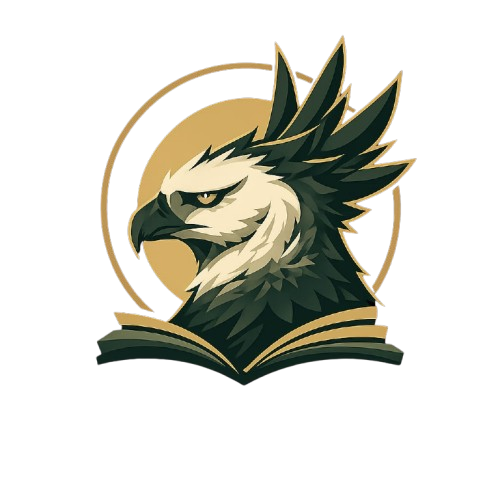
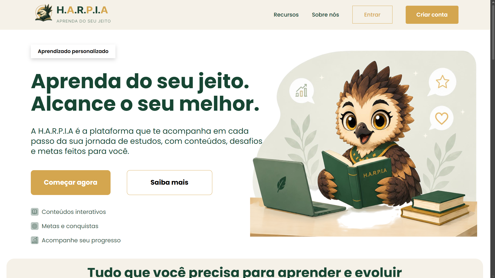
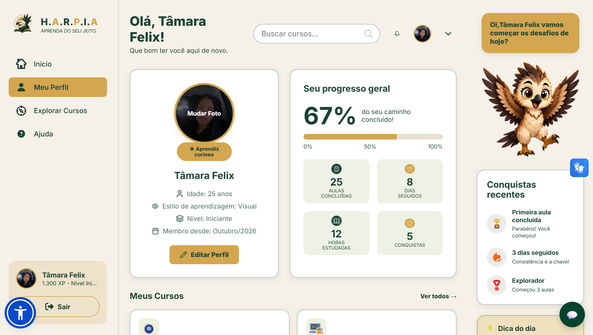
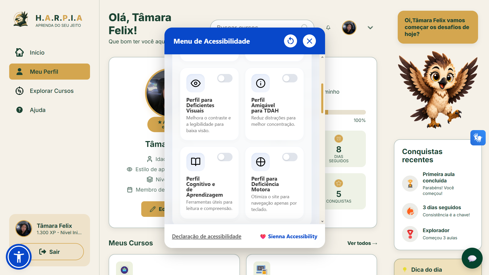
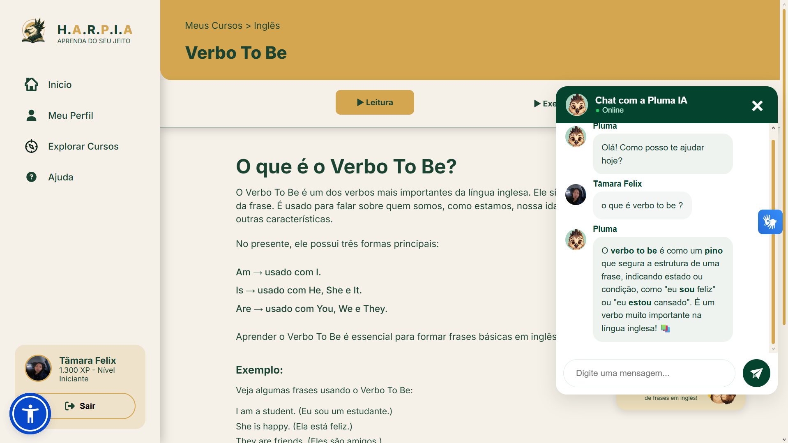
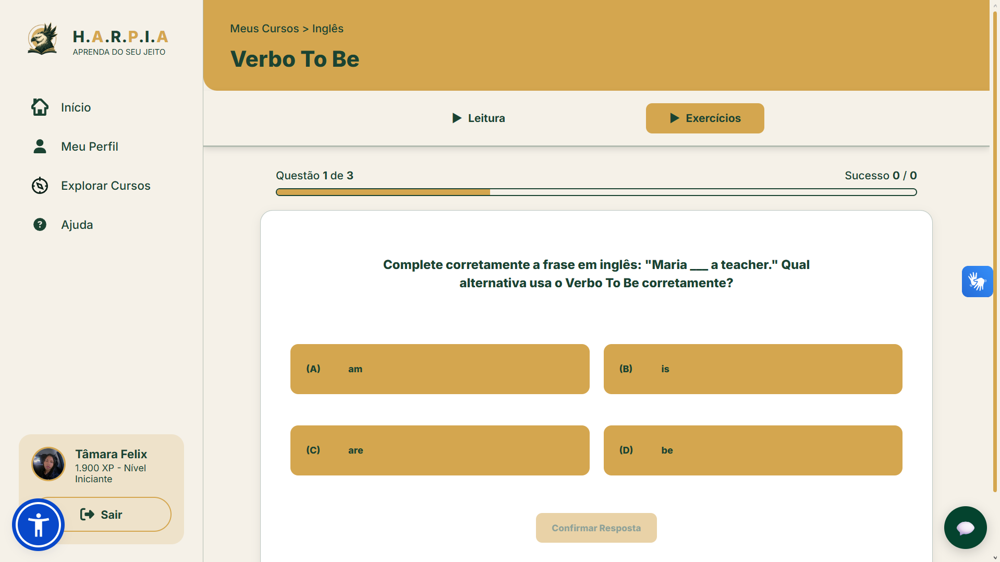

# H.A.R.P.I.A. — Hub de Aprendizagem Responsiva, Personalizada, Inclusiva e Acessível

  

> *"Acreditamos que cada pessoa aprende de um jeito. Por isso, criamos um espaço onde todos podem aprender do seu jeito."*

---

## 🎯 Objetivo do Projeto

O **H.A.R.P.I.A.** é uma plataforma educacional desenvolvida para oferecer uma experiência de aprendizagem personalizada, humana e inclusiva para estudantes, com foco em pessoas neurodivergentes.

O objetivo do projeto é colocar o estudante no centro do processo de aprendizagem, utilizando inteligência artificial e recursos de acessibilidade que permitem uma experiência mais adaptada às necessidades de cada usuário.

A plataforma busca auxiliar estudantes com diferentes formas de aprendizagem, incluindo pessoas neurodivergentes como pessoas com TEA, TDAH e dislexia.

---

## 🛠️ Tecnologias Utilizadas

### 🎨 Front-end & Design

---

### ♿ Acessibilidade e Inclusão

---

### ⚙️ Back-end, Segurança & Deploy

---

### 🤖 Inteligência Artificial

---

# 📸 Telas da Plataforma

### 🌐 Apresentação (Antes do Login)

  <b>🏠 Landing Page / Tela Inicial do Projeto</b>  
    

---

### 🎓 Área do Estudante (Após o Login)

<table>
<tr>

<td align="center" width="50%">
<b>👤 Perfil do Estudante</b>  

</td>

<td align="center" width="50%">
<b>♿ Plugin de Acessibilidade (Sienna)</b>  

</td>

</tr>

<tr>

<td align="center" width="50%">
<b>📚 Conteúdo da Matéria & Assistente IA Pluma</b>  

</td>

<td align="center" width="50%">
<b>✏️ Exercício Prático Interativo</b>  

</td>

</tr>
</table>

---

# ✨ Principais Funcionalidades

- [x] **Cadastro e Perfil do Usuário:** Autenticação segura com hash de senhas utilizando Bcrypt e autenticação baseada em tokens JWT.

- [x] **Plugin de Acessibilidade Sienna:**
  - 🧠 Painéis voltados para diferentes necessidades de acessibilidade;
  - 📖 Ajuste de fonte e tamanho do texto;
  - 📏 Régua de leitura para auxiliar na concentração durante a leitura;
  - 🎨 Alteração de cores e contraste da interface.

- [x] **Suporte e Tradução em Libras:** Recursos inclusivos para auxiliar usuários surdos.

- [x] **Tutor Inteligente de IA:** Assistente virtual Pluma integrado ao modelo Llama através de uma API desenvolvida com Node.js, permitindo que estudantes tirem dúvidas durante os estudos.

- [x] **Conteúdos Educacionais:** Materiais organizados por áreas como Inglês, Programação, Ciências, Português e Matemática.

- [x] **Exercícios Práticos:** Atividades relacionadas aos conteúdos estudados para reforçar o aprendizado.

---

# 🤖 Pluma — Assistente Virtual da H.A.R.P.I.A.

A **Pluma** é a assistente virtual baseada em Inteligência Artificial da plataforma.

Ela foi desenvolvida para auxiliar estudantes durante os estudos, permitindo perguntas relacionadas aos conteúdos educacionais disponíveis na H.A.R.P.I.A.

A Pluma possui um contexto próprio dentro da plataforma, reconhecendo sua identidade como assistente virtual da H.A.R.P.I.A., uma plataforma educacional personalizada voltada para estudantes e pessoas neurodivergentes.

Sua integração foi realizada utilizando uma API desenvolvida com **Node.js e Express.js**, utilizando o modelo **Llama**.

---

# 👥 Equipe H.A.R.P.I.A

| Integrante | Área de contribuição | LinkedIn |
|------------|----------------------|----------|
| Victor | PO e Dev FullStack | [LinkedIn](https://www.linkedin.com/in/victor-melodigital/) |
| Alyne  | Scrum Master e Dev Front | [LinkedIn](https://br.linkedin.com/in/alyne-cristina-de-magalh%C3%A3es-dornelas-bb6132192) |
| Tâmara | Dev FullStack | [LinkedIn](https://www.linkedin.com/in/tamarafelix/) |
| Jhonathan  | Dev Front e Design | [LinkedIn](https://www.linkedin.com/in/johnatan-nascimento-dev?utm_source=share_via&utm_content=profile&utm_medium=member_android) |
| Isabella | Design UI/UX | [LinkedIn](https://www.linkedin.com/in/isabelladasillva) |
| Beatriz | Design UI/UX | [LinkedIn](https://www.linkedin.com/in/beatriz-de-paula-51a9771a5/) |
| Diego | Dev  | [LinkedIn](LINK) |

 

# 🌐 Veja funcionando

A versão publicada do H.A.R.P.I.A. está disponível em:

🔗 https://devtamarafelix.github.io/projeto_site_harpia/